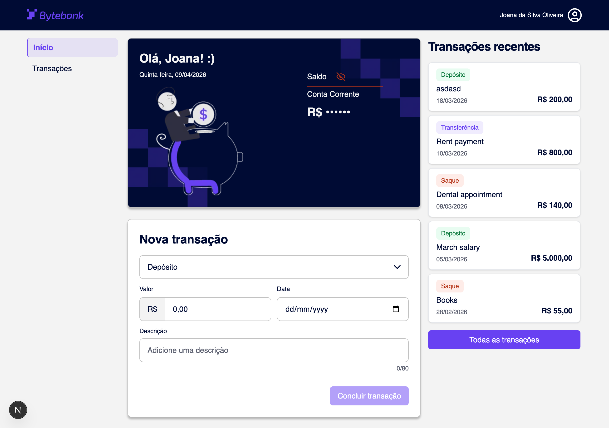
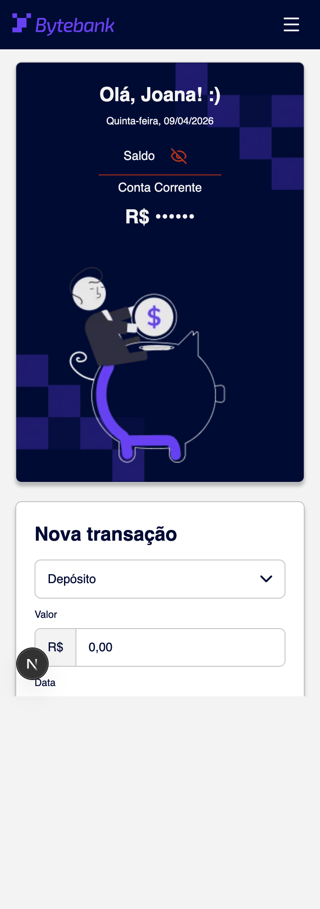
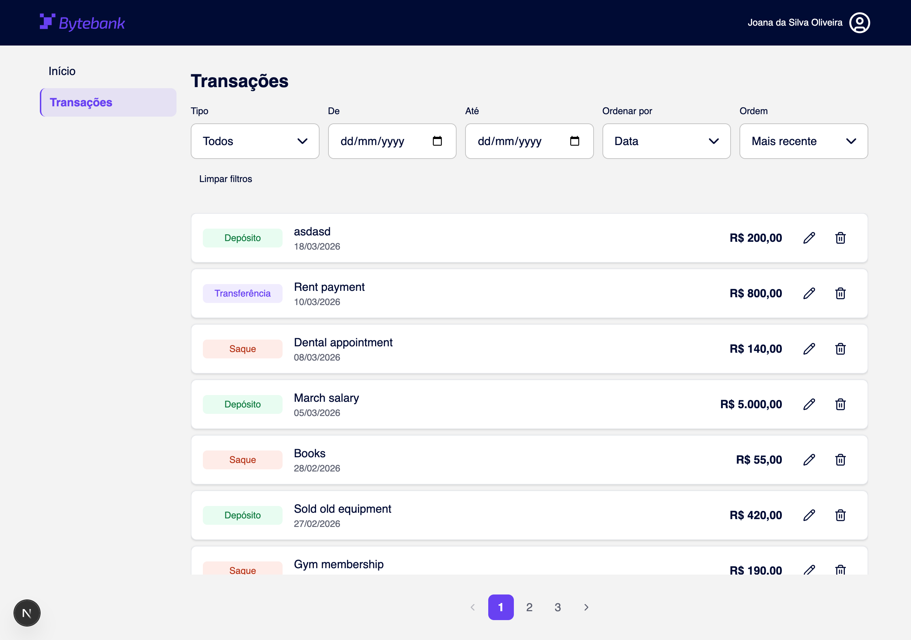
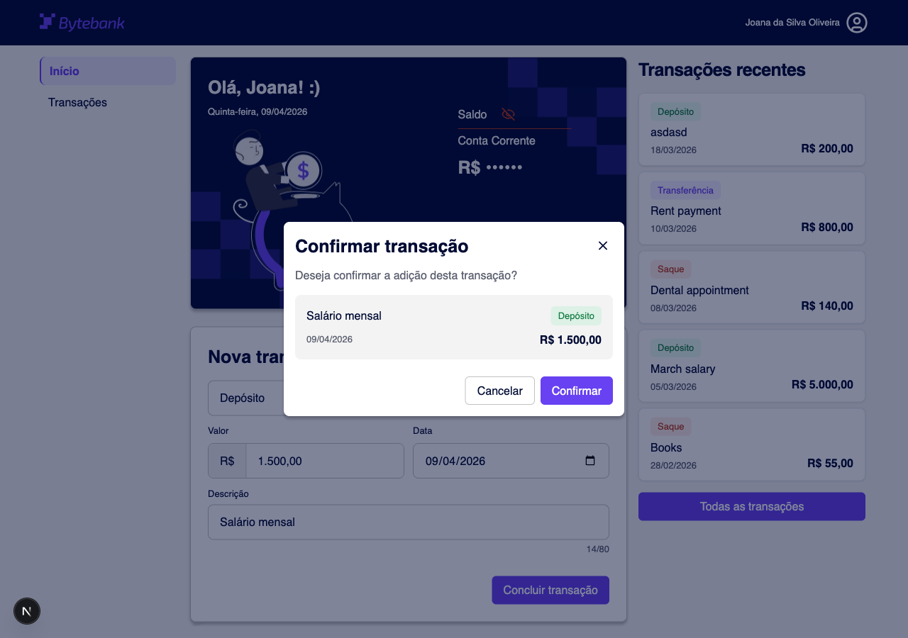
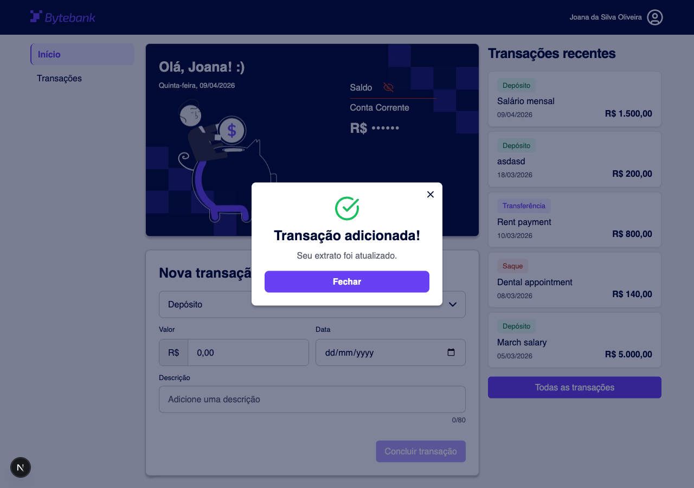

# Bytebank — Gerenciamento Financeiro

Frontend de gestão financeira pessoal construído com Next.js 16 e Design System próprio, desenvolvido como tech challenge da pós-graduação FIAP Frontend Engineering.



---

## Funcionalidades

- **Dashboard** — saldo da conta com toggle de visibilidade e lista das transações mais recentes
- **Lista de transações** — filtros por tipo, intervalo de datas e ordenação; paginação server-side via json-server; estado persiste na URL via query params
- **CRUD completo** — adicionar, editar e excluir transações com modais de confirmação e feedback visual
- **Design System** — biblioteca de componentes documentada no Storybook com tokens de cor, tipografia e espaçamento

---

## Pré-requisitos

| Ferramenta | Versão mínima |
| ---------- | ------------- |
| Node.js    | 20+           |
| npm        | 10+           |

---

## Instalação e execução

### 1. Clonar o repositório

```bash
git clone git@github.com:fiap-6frnt-tech-challenge/tech-challenge.git
cd tech-challenge
```

### 2. Instalar dependências

```bash
npm install
```

### 3. Configurar variáveis de ambiente

Crie o arquivo `.env.local` na raiz do projeto:

```env
NEXT_PUBLIC_API_URL=http://localhost:3001
```

### 4. Iniciar o servidor de desenvolvimento

```bash
npm run dev
```

Este comando inicia simultaneamente:

- **Next.js** em `http://localhost:3000`
- **json-server** (mock API) em `http://localhost:3001`

> O json-server assiste o arquivo `data/transactions.json` e expõe uma REST API completa. A aplicação não funciona sem ele rodando.

---

## Scripts disponíveis

| Comando                   | Descrição                                            |
| ------------------------- | ---------------------------------------------------- |
| `npm run dev`             | Inicia Next.js + json-server simultaneamente         |
| `npm run build`           | Build de produção                                    |
| `npm start`               | Inicia o servidor de produção (requer `build` antes) |
| `npm run api`             | Inicia apenas o json-server                          |
| `npm run storybook`       | Abre o Storybook em `http://localhost:6006`          |
| `npm run build-storybook` | Gera o Storybook estático em `storybook-static/`     |
| `npm run lint`            | Executa o ESLint                                     |
| `npm run format`          | Formata todos os arquivos com Prettier               |

---

## Variáveis de ambiente

| Variável              | Obrigatória | Descrição                          | Valor padrão            |
| --------------------- | ----------- | ---------------------------------- | ----------------------- |
| `NEXT_PUBLIC_API_URL` | Sim         | URL base da API mock (json-server) | `http://localhost:3001` |

---

## Estrutura do projeto

```
tech-challenge/
├── app/
│   ├── page.tsx                  # Home — saldo, nova transação, recentes
│   ├── transactions/
│   │   └── page.tsx              # Listagem completa com filtros
│   └── layout.tsx                # Root layout — providers, Header, Sidebar
│
├── components/
│   ├── ui/                       # Átomos do Design System
│   │   ├── Button/
│   │   ├── Input/
│   │   ├── Select/
│   │   ├── Modal/
│   │   ├── FeedbackModal/
│   │   ├── Pagination/
│   │   └── ...
│   └── features/                 # Componentes de feature compostos
│       ├── TransactionForm/
│       ├── TransactionList/
│       ├── TransactionItem/
│       ├── BalanceCard/
│       ├── EditTransactionModal/
│       └── ...
│
├── context/
│   ├── TransactionsContext.tsx   # Estado global de transações + CRUD
│   └── FeedbackContext.tsx       # Estado global do FeedbackModal
│
├── hooks/
│   ├── useTransactionFilters.ts  # Filtro e ordenação com persistência em URL
│   └── usePaginatedTransactions.ts # Paginação server-side via json-server
│
├── lib/
│   └── transactions.ts           # Helpers puros: getAll, calculateBalance, getRecent
│
├── services/                     # TransactionService — chamadas HTTP ao json-server
├── data/
│   └── transactions.json         # Dados mock (lidos e escritos pelo json-server)
├── types/
│   └── index.ts                  # Transaction, TransactionType, Account
├── shared/                       # Constantes e utilitários de formatação
└── .storybook/                   # Configuração do Storybook
```

---

## Tech stack

| Preocupação          | Escolha                 | Motivo                                                              |
| -------------------- | ----------------------- | ------------------------------------------------------------------- |
| Framework            | Next.js 16 (App Router) | Exigência do challenge                                              |
| Linguagem            | TypeScript              | Type safety, melhor DX e autocompletar                              |
| Estilização          | Tailwind CSS v4         | Utility-first, iteração rápida, integração nativa com Design System |
| Design System        | Custom + Storybook      | Exigência do challenge; tokens CSS para consistência visual         |
| Gerenciamento estado | React Context API       | Escopo adequado ao app; sem dependências extras                     |
| Formulários          | React Hook Form + Zod   | Validação leve com inferência de tipos a partir do schema           |
| Mock backend         | json-server             | REST API zero-config sobre arquivo JSON                             |
| Ícones               | Lucide React            | Consistente, tree-shakeable                                         |
| Testes               | Vitest + Playwright     | Testes de componente via addon Storybook                            |
| Commit hooks         | Husky + lint-staged     | Garante lint e formatação em todo commit                            |

---

## Design System

Biblioteca de componentes documentada com variantes, props, acessibilidade e exemplos interativos.

📖 **[Acessar Storybook →](https://phase-1--69d58ff921fbab085884a584.chromatic.com/)**

Destaques:

- **Tokens de design** — cores, espaçamento, tipografia e sombras via CSS custom properties
- **Acessibilidade** — WCAG 2.1 AA: ARIA, navegação por teclado, foco gerenciado nos modais
- **Responsivo** — mobile-first: 375px · 768px · 1024px+

---

## Screenshots

### Home — desktop (1280px)


### Home — mobile (375px)



### Transações — desktop (1280px)



### Modal — Confirmar nova transação



### Modal — Transação adicionada com sucesso


